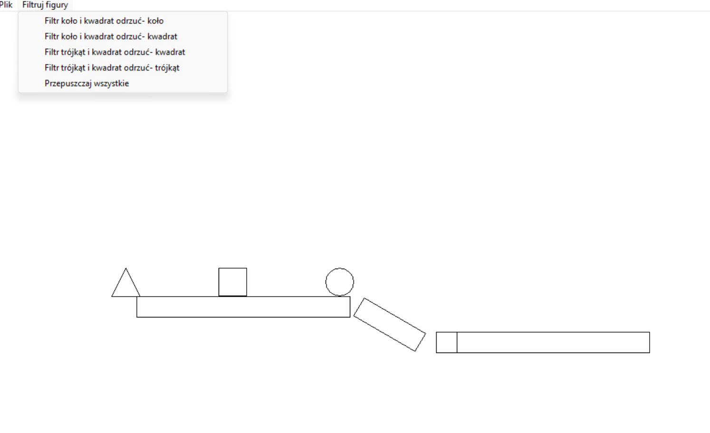

**Alicja Morawska 203168
  Aleksandra Stosio 203792**

# Projekt 4 - Symulacja Taśmy Produkcyjnej (GDI+)

## Opis

Projekt realizuje **Zadanie 2** z przedmiotu *Techniki Programowania 2* – stworzenie aplikacji symulującej **pracę taśmy produkcyjnej** z mechanizmem **łączenia elementów** oraz **sortowania figur**.

Aplikacja graficzna została zaimplementowana w **C++ z użyciem GDI+**, a logika ruchu, kolizji i filtracji opiera się na klasie `Element` oraz mechanizmie zdarzeń systemowych (`WndProc`).

## Funkcjonalności

- Dynamiczna symulacja taśmy z poruszającymi się figurami (koło, kwadrat, trójkąt)
- Łączenie półproduktów w gotowy produkt po zderzeniu
- Sortowanie elementów w oparciu o ich typ
- Automatyczne przywracanie odrzuconych elementów
- Możliwość zmiany trybu filtra przez menu
- Rysowanie figur za pomocą GDI+ (`Ellipse`, `Rectangle`, `Polygon`)
- Logika segmentów toru, kolizji i reaktywacji figur po przejściu całej taśmy

##  Zrealizowane podzadania

### ✅ 2.1 – Budowanie produktu
- Trzy typy elementów (`TypFigury`): `KOLO`, `KWADRAT`, `TROJKAT`
- Klasa `Element` reprezentuje pojedynczy półprodukt
- Elementy poruszają się przez trzy segmenty taśmy i łączą się w gotowy produkt

### ✅ 2.2 – Koło poprawne, kwadrat odrzucony
- Tryb `FILTR_KOLO_I_KWADRAT_ODRZUC_KWADRAT`

### ✅ 2.3 – Kwadrat poprawny, koło odrzucony
- Tryb `FILTR_KOLO_I_KWADRAT_ODRZUC_KOLO`

### ✅ 2.4 – Kwadrat poprawny, trójkąt odrzucony
- Tryb `FILTR_KWADRAT_I_TROJKAT_ODRZUC_TROJKAT`

### ✅ 2.5 – Trójkąt poprawny, kwadrat odrzucony
- Tryb `FILTR_KWADRAT_I_TROJKAT_ODRZUC_KWADRAT`

## Interfejs graficzny

- Okna i zdarzenia tworzone za pomocą `WinAPI`
- Rysowanie figur i taśmy z użyciem `GDI+`
- Figury poruszają się zgodnie z zadanym kątem `alpha` i są rysowane tylko, jeśli są `aktywny && widoczny`
- Prostokątny filtr rysowany w miejscu detekcji kolizji (`CzyZderzenieZFiltrem`)

## Sposób działania

1. Program tworzy 3 figury (koło, kwadrat, trójkąt) startujące z różnych pozycji.
2. Figury przesuwają się przez segmenty: poziomy ruch → ukośny → końcowy odcinek.
3. Kolizja z filtrem aktywuje odpowiednie działanie w zależności od `trybFiltru`.
4. Odrzucona figura znika i zostaje ponownie zainicjowana na taśmie.
5. Wyłączenie filtra (`FILTR_WYLACZONY`) przywraca figury z backupu.

## Sterowanie

Dostępne filtry w menu (`resource.h`):

| Filtr           | Efekt działania                                   |
| --------------- | ------------------------------------------------- |
| ID_FILTER_1     | Odrzuca **koła**, przepuszcza kwadraty i trójkąty |
| ID_FILTER_2     | Odrzuca **kwadraty**, przepuszcza koła i trójkąty |
| ID_FILTER_3     | Odrzuca **kwadraty**, przepuszcza trójkąty i koła |
| ID_FILTER_4     | Odrzuca **trójkąty**, przepuszcza kwadraty i koła |
| ID_FILTER_OFF   | Wyłącza filtr, przywraca wszystkie figury         |

## Pliki

- `main.cpp` – logika, klasa `Element`, obsługa filtrów i renderowanie
- `resource.h` – identyfikatory filtrów i menu
- `framework.h` – nagłówki systemowe

## Zrzut ekranu

